# Backlog roadmap · Caminho completo da esteira AWS

Este documento é o **mapa de entrega**: ordem, dependências e definição de “pronto” por onda.
As stories detalhadas estão em [`stories.md`](stories.md).

---

## Visão do caminho (fim a fim)

```mermaid
flowchart LR
    subgraph W1["W1 · Fundação"]
        S3["S3 insumo/origem/enriquecido/relatorios"]
        IAM["IAM roles"]
    end

    subgraph W2["W2 · Origem"]
        O["carregar_origem_dia → origem/dt="]
    end

    subgraph W3["W3 · Enriquecido"]
        E["enriquecer_dia → enriquecido/dt="]
    end

    subgraph W4["W4 · Orquestração"]
        SF["Step Functions + EventBridge"]
    end

    subgraph W5["W5 · D-1"]
        R1["Excel D-1 → relatorios/"]
    end

    subgraph W6["W6 · D-2/D-3/Ops"]
        R23["Excel D-2 D-3"]
        ATH["Athena + alarmes"]
    end

    subgraph W7["W7 · Portal Web"]
        PW["Angular + FastAPI + Cognito"]
    end

    W1 --> W2 --> W3 --> W4 --> W5 --> W6 --> W7
```



---

## Ondas de entrega (como gerenciar)

| Onda | Épico | Stories | Unidade deploy | Pronto quando… | Depende de |
|------|-------|---------|----------------|----------------|------------|
| **W1** | E1 | E1-US01…04 | U1 Infra | CSV no S3; prefixos criados; IAM documentado | — |
| **W2** | E2 | E2-US01…03 | U2 Origem | 1 dia `2022-01-01` em `origem/dt=` = parquet local | W1 |
| **W3** | E3 | E3-US01…03 | U3 Enriquecido | Mesmo dia em `enriquecido/dt=` com colunas `_*` | W2 |
| **W4** | E4 | E4-US01…03 | U4 Orquestração | `processar_dia(dt)` roda na AWS para 3 dias de teste | W3 |
| **W5** | E5 | E5-US01…03 | U5 Relatório D-1 | Excel D-1 no S3 ≡ notebook (mesmo dia) | W4 |
| **W6** | E6+E7 | E6/E7-US* | U6 Relatórios+Ops | D-2, D-3 Excel + Athena + alarme | W5 |
| **W7** | E8 | E8-US01…12 | U8 Portal (Infra+API+Web) | Login → insight D-1 → download Excel em dev | W6 |

**Regra:** só avance a onda seguinte quando **Definition of Done (DoD)** da onda atual estiver marcada `done` no `aidlc-state.md`.

---

## Mapeamento local → AWS (referência única)

| Notebook (local) | AWS (alvo) | Onda |
|------------------|------------|------|
| `retail_store_inventory.csv` | `s3://…/insumo/retail_store_inventory.csv` | W1 |
| `tabela_origem/dt=` | `s3://…/origem/dt=YYYY-MM-DD/data.parquet` | W2 |
| `carregar_origem_dia(dt)` | Glue Job ou Lambda “origem” | W2 |
| `tabela_enriquecida/dt=` | `s3://…/enriquecido/dt=YYYY-MM-DD/data.parquet` | W3 |
| `enriquecer_dia(dt)` | Glue Job “enriquecimento” | W3 |
| `processar_dia(dt)` | Step Functions (origem → enriquecido) | W4 |
| `DATA_EXECUCAO` / `DIA_DADO` | Parâmetro da execução + EventBridge cron | W4–W5 |
| `relatorio_D1_exec*_dado*.xlsx` | `s3://…/relatorios/D1/…` | W5 |
| D-2 / D-3 (planejado no notebook) | `relatorios/D2/`, `relatorios/D3/` | W6 |
| — | Glue Catalog + Athena | W6 |

---

## Definition of Done por onda

### W1 — Fundação
- [ ] Buckets/prefixos criados e documentados
- [ ] CSV de insumo acessível na conta AWS
- [ ] Roles IAM criadas (Glue, Lambda, Step Functions leitura/escrita S3)
- [ ] Diagrama atualizado ou nota em `aidlc-docs`

### W2 — Origem
- [ ] Job/script `carregar_origem_dia` deployado
- [ ] Partição teste `dt=2022-01-01` gerada
- [ ] Row count e schema compatíveis com notebook §1

### W3 — Enriquecimento
- [ ] Job `enriquecer_dia` deployado
- [ ] Colunas `_revenue`, `_stockout`, `_lost`, `_is_weekend`, `dt` presentes
- [ ] Amostra validada vs. `tabela_enriquecida/` local (mesmo `dt`)

### W4 — Orquestração
- [ ] Step Function executa origem → enriquecido para `dt` informado
- [ ] EventBridge rule (ou execução manual documentada para POC)
- [ ] Falha em um `dt` não apaga outras partições

### W5 — Relatório D-1
- [ ] Lambda (ou Glue+script) gera `.xlsx` com naming do notebook
- [ ] Insight + fórmulas Excel presentes
- [ ] Arquivo em `relatorios/D1/` acessível ao analista (P1)

### W6 — D-2, D-3 e operação
- [ ] Relatórios D-2 e D-3 no padrão D-1
- [ ] Tabela Athena sobre `enriquecido/dt=`
- [ ] Alarme se execução diária falhar

### W7 — Portal Web
- [ ] Terraform `modules/portal/` aplicado em dev
- [ ] Login Cognito + Angular shell funcionando
- [ ] BFF FastAPI com endpoints insumos/origem/enriquecido/insights/pipeline
- [ ] Dashboards D-1, D-2, D-3 com download Excel
- [ ] Disparo SFN + alarmes na UI
- [ ] E2E: login → D-1 → download Excel validado

---

## Gestão no dia a dia

### Quadro Kanban sugerido (colunas)
`Backlog` → `Ready` → `In Progress` → `Review` → `Done`

- Mova só stories da **onda atual** para `In Progress` (máx. 1–2 por vez).
- `Ready` = dependências da onda anterior `Done` + critérios claros.

### Cerimônia mínima (solo ou time pequeno)
1. **Início de onda:** revisar DoD da onda anterior; marcar stories `ready`.
2. **Durante:** atualizar status em `stories.md`; Construction via AI-DLC com escopo = 1 onda.
3. **Fim de onda:** validar DoD; registrar em `audit.md`; atualizar `aidlc-state.md`.

### O que NÃO fazer
- Implementar W4 antes de W2/W3 estáveis.
- Misturar stories de W5 (Excel) com W1 (S3) no mesmo PR grande.
- Alterar lógica de negócio na AWS sem atualizar o notebook (manter paridade).

---

## Caminho crítico (sequência obrigatória)

```
E1-US01 → E1-US02 → E1-US03 → E1-US04
    → E2-US01 → E2-US02 → E2-US03
    → E3-US01 → E3-US02 → E3-US03
    → E4-US01 → E4-US02 → E4-US03
    → E5-US01 → E5-US02 → E5-US03
    → E6-US01 → E6-US02 → E7-US01 → E7-US02
    → E8-US01 → E8-US02 → E8-US03
    → E8-US04 → E8-US05 → E8-US06
    → E8-US07 → E8-US08 → E8-US09 → E8-US10 → E8-US11
    → E8-US12
```

Stories **E2-US03**, **E3-US03**, **E5-US03** são validação/paridade — não pule.  
**E8-US12** valida E2E do portal — não pule.

---

## Estimativa de complexidade (relativa)

| Onda | Esforço | Risco |
|------|---------|-------|
| W1 | Baixo | Baixo |
| W2 | Médio | Médio (schema/partição) |
| W3 | Médio | Alto (regras `_stockout`/`_lost`) |
| W4 | Médio | Médio |
| W5 | Médio | Médio (openpyxl em Lambda) |
| W6 | Alto | Médio (D-2/D-3 ainda não no notebook) |
| W7 | Alto | Médio (Angular + ECS + integração AWS) |

---

## Próxima ação recomendada

1. Aprovar user stories W7 (`stories.md` Épico E8).
2. Iniciar AI-DLC **Workflow Planning W7** → unidades U8 Infra / API / Web.
3. Construction W7 após aprovação do execution plan.
