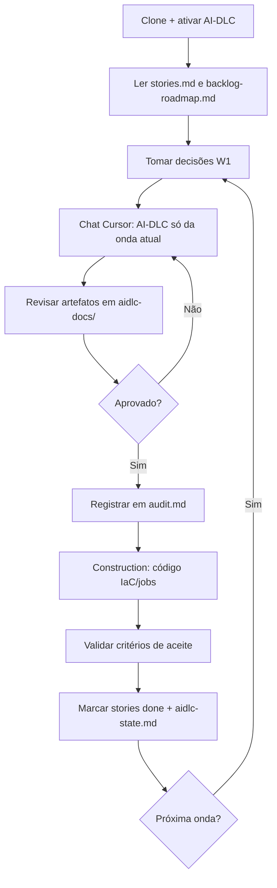

# AI-DLC no Cursor — configuração deste projeto

Este projeto usa o **AI-DLC** (AI-Driven Development Life Cycle): uma metodologia em que o agente planeja antes de codar, faz perguntas quando necessário e pede aprovação por etapa.

O Cursor **não** lê regras em pastas arbitrárias. Ele só carrega **Project Rules** de `.cursor/rules/`. Por isso a pasta `aidlc-rules/` (fonte) precisa ser “ativada” com os comandos abaixo.

## O que fica ativo depois da configuração

| Caminho | Função |
|---------|--------|
| `.cursor/rules/ai-dlc-workflow.mdc` | Regra principal — injetada em **todo** chat do projeto |
| `.aidlc-rule-details/` | Regras detalhadas por fase (inception, construction, etc.) |
| `aidlc-rules/` | **Fonte** versionada — não é lida pelo Cursor diretamente |

Em **Settings → Rules**, deve aparecer `ai-dlc-workflow` com `alwaysApply: true`.

## Resumo das três ações

1. **Criar a pasta que o Cursor lê** — `.cursor/rules/` é o único local de Project Rules automáticas.
2. **Montar o arquivo de regra principal** — frontmatter (`.mdc`) + corpo de `core-workflow.md` num único arquivo.
3. **Copiar as regras detalhadas** — de `aidlc-rules/aws-aidlc-rule-details/` para `.aidlc-rule-details/` (caminho que o workflow consulta no Cursor).

## Configuração no Windows (PowerShell)

Execute na **raiz do projeto** (`project-datamesh-1`):

```powershell
New-Item -ItemType Directory -Force -Path ".cursor\rules"

$frontmatter = @"
---
description: "AI-DLC (AI-Driven Development Life Cycle) adaptive workflow for software development"
alwaysApply: true
---

"@
$frontmatter | Out-File -FilePath ".cursor\rules\ai-dlc-workflow.mdc" -Encoding utf8

Get-Content "aidlc-rules\aws-aidlc-rules\core-workflow.md" | Add-Content ".cursor\rules\ai-dlc-workflow.mdc"

New-Item -ItemType Directory -Force -Path ".aidlc-rule-details"
Copy-Item "aidlc-rules\aws-aidlc-rule-details\*" ".aidlc-rule-details\" -Recurse
```

### O que cada comando faz

| Comando | Efeito |
|---------|--------|
| `New-Item ... ".cursor\rules"` | Cria o diretório onde o Cursor carrega Project Rules |
| `Out-File ... ai-dlc-workflow.mdc` | Escreve o cabeçalho YAML: `description` + `alwaysApply: true` |
| `Get-Content ... \| Add-Content` | Anexa o workflow completo (`core-workflow.md`) abaixo do frontmatter |
| `New-Item ... ".aidlc-rule-details"` | Pasta oculta onde o agente busca regras por fase |
| `Copy-Item ... -Recurse` | Copia inception, construction, common, extensions, etc. |

## Equivalente em bash (Linux / macOS / Git Bash)

```bash
mkdir -p .cursor/rules

cat > .cursor/rules/ai-dlc-workflow.mdc << 'EOF'
---
description: "AI-DLC (AI-Driven Development Life Cycle) adaptive workflow for software development"
alwaysApply: true
---

EOF

cat aidlc-rules/aws-aidlc-rules/core-workflow.md >> .cursor/rules/ai-dlc-workflow.mdc

mkdir -p .aidlc-rule-details
cp -r aidlc-rules/aws-aidlc-rule-details/* .aidlc-rule-details/
```

## Estrutura de pastas

```
project-datamesh-1/
├── .cursor/
│   └── rules/
│       └── ai-dlc-workflow.mdc      ← regra ativa (gerada)
├── .aidlc-rule-details/             ← detalhes ativos (cópia)
│   ├── common/
│   ├── inception/
│   ├── construction/
│   ├── operations/
│   └── extensions/
└── aidlc-rules/                     ← fonte (versionar no git)
    ├── VERSION
    ├── aws-aidlc-rules/
    │   └── core-workflow.md
    └── aws-aidlc-rule-details/
        └── ...
```

## Atualizar regras após mudar a fonte

Se `aidlc-rules/` for atualizado (nova versão do AI-DLC), rode de novo os comandos de cópia:

```powershell
# Recriar regra principal
$frontmatter = @"
---
description: "AI-DLC (AI-Driven Development Life Cycle) adaptive workflow for software development"
alwaysApply: true
---

"@
$frontmatter | Out-File -FilePath ".cursor\rules\ai-dlc-workflow.mdc" -Encoding utf8
Get-Content "aidlc-rules\aws-aidlc-rules\core-workflow.md" | Add-Content ".cursor\rules\ai-dlc-workflow.mdc"

# Recopiar detalhes
Remove-Item ".aidlc-rule-details\*" -Recurse -Force -ErrorAction SilentlyContinue
Copy-Item "aidlc-rules\aws-aidlc-rule-details\*" ".aidlc-rule-details\" -Recurse
```

## Verificar se está funcionando

1. Abra **Cursor → Settings → Rules** e confirme `ai-dlc-workflow` listada.
2. Inicie um chat novo no projeto e peça algo de desenvolvimento — o agente deve seguir o fluxo adaptativo (planejar, perguntar, pedir aprovação) em vez de codar direto.
3. Confirme que existem `.cursor/rules/ai-dlc-workflow.mdc` e `.aidlc-rule-details/common/process-overview.md`.

## Versão das regras

Versão da fonte em `aidlc-rules/VERSION` (atual: **1.0.0**).

## Observações

- **`aidlc-rules/` sozinha não basta** — o Cursor ignora essa pasta até os arquivos estarem em `.cursor/rules/` e `.aidlc-rule-details/`.
- **`alwaysApply: true`** faz a regra valer em toda conversa do projeto; remova ou mude para `false` se quiser ativar só sob demanda.
- O workflow procura detalhes nesta ordem: `.aidlc/aidlc-rules/...`, **`.aidlc-rule-details/`** (setup Cursor), `.kiro/...`, `.amazonq/...` — este projeto usa `.aidlc-rule-details/`.

---

## Processo de desenvolvimento (como usar o AI-DLC neste projeto)

Esta seção descreve **como o desenvolvedor inicia a primeira story**, quais **decisões tomar** e como **não perder o fluxo** entre chats do Cursor.

Documentação complementar:

- Backlog e stories: [`../aidlc-docs/`](../aidlc-docs/)
- README do projeto: [`../README.md`](../README.md)
- Notebook brownfield: [`../Esteira_3Relatorios_D1_D2_D3.ipynb`](../Esteira_3Relatorios_D1_D2_D3.ipynb)

### Princípio

> **Não peça “cria tudo na AWS”.** Trabalhe **uma onda (W1…W6) por vez**, aprove cada fase em `aidlc-docs/audit.md` e mantenha **paridade com o notebook** (`carregar_origem_dia`, `enriquecer_dia`, `processar_dia`, relatório D-1).

### Onde você está no projeto

| Item | Onde ver |
|------|----------|
| Fase AI-DLC atual | [`aidlc-docs/aidlc-state.md`](../aidlc-docs/aidlc-state.md) |
| 20 user stories | [`aidlc-docs/inception/user-stories/stories.md`](../aidlc-docs/inception/user-stories/stories.md) |
| Ordem W1→W6 | [`aidlc-docs/inception/user-stories/backlog-roadmap.md`](../aidlc-docs/inception/user-stories/backlog-roadmap.md) |
| Aprovações | [`aidlc-docs/audit.md`](../aidlc-docs/audit.md) |

**Primeira entrega:** onda **W1** / épico **E1** (S3 + insumo + IAM + documentação). Glue, Lambda e Step Functions vêm depois.

### Fluxo do desenvolvedor



### Decisões obrigatórias antes de codar (W1)

Registre em [`aidlc-docs/aidlc-state.md`](../aidlc-docs/aidlc-state.md) (ou em `requirements.md` quando o AI-DLC gerar):

| Decisão | Opções | Sugestão POC |
|---------|--------|--------------|
| Região AWS | `sa-east-1`, `us-east-1`, … | `us-east-1` (N. Virginia) |
| IaC | CDK, Terraform, Console | Terraform ou CDK Python |
| Buckets | 1 bucket com prefixos vs. vários | **1 bucket** `retail-inventory-insights-dev` |
| Ambiente | `dev`, `prod` | Começar só `dev` |

**Layout S3 recomendado (1 bucket):**

```
s3://retail-inventory-insights-dev/
  insumo/retail_store_inventory.csv
  origem/dt=2022-01-01/data.parquet
  enriquecido/dt=2022-01-01/data.parquet
  relatorios/D1/
  relatorios/D2/
  relatorios/D3/
```

Decisões que **podem esperar**:

| Decisão | Onda |
|---------|------|
| Horário do cron (EventBridge) | W4 |
| Excel: S3 apenas vs. e-mail | W5 |
| Athena e alarmes | W6 |

**Regra de ouro:** lógica de negócio vem do notebook — na AWS só muda *onde* roda e *onde* grava.

### Como iniciar a primeira story (W1)

#### Passo 0 · Preparação

1. Rode o notebook local e confirme `tabela_origem/`, `tabela_enriquecida/` e um Excel D-1.
2. Leia o roadmap W1 em `backlog-roadmap.md`.
3. Em `stories.md`, marque **E1-US01** como `ready`.

#### Passo 1 · Chat no Cursor (AI-DLC)

Abra chat **novo** e use um pedido explícito (ajuste região e IaC):

```text
Siga o AI-DLC para datamesh-retail-inventory-insights-d1-d2-d3.

Escopo desta rodada: APENAS Onda W1 (E1-US01 a E1-US04).
Brownfield: Esteira_3Relatorios_D1_D2_D3.ipynb.

Decisões:
- Região: us-east-1
- IaC: Terraform
- 1 bucket: retail-inventory-insights-dev
- Ambiente: dev

Execute: Workspace Detection → Reverse Engineering →
Requirements Analysis → Workflow Planning → Design mínimo U1.

NÃO implementar Glue, Lambda ou Step Functions ainda.
```

O agente deve gerar artefatos em `aidlc-docs/` e **parar para aprovação**.

#### Passo 2 · Revisar Inception e aprovar

Quando o agente exibir **REVIEW REQUIRED**, revise os artefatos **antes** de Construction. Guia completo: [`aidlc-docs/README.md#revisar-inception-antes-de-construction`](../aidlc-docs/README.md#revisar-inception-antes-de-construction).

Resumo:

1. `requirements.md` — escopo só W1; sem Glue/Lambda/SFN
2. `stories.md` — E1-US01…04 com critérios testáveis
3. `execution-plan.md` — Construction = Terraform U1
4. `reverse-engineering/` — bate com o notebook
5. `application-design/` — S3 + IAM + upload CSV manual

Se ok → **Approve & Continue** e registre em `aidlc-docs/audit.md`. Se não → **Request Changes** (arquivo + o que mudar).

Depois da aprovação:

1. Atualize `aidlc-state.md`: W1 → `in_progress`
2. Construction gera `terraform/` — valide com `terraform plan` antes de `apply`

#### Passo 3 · Implementar E1 na ordem

```
E1-US01 (S3)  →  E1-US03 (IAM)  →  E1-US02 (CSV)  →  E1-US04 (docs)
```

| Story | Entrega | Validação |
|-------|---------|-----------|
| E1-US01 | Bucket + prefixos + block public + tags | `aws s3 ls` ou console |
| E1-US03 | Roles Glue, Lambda-relatórios, Step Functions | Policies só nos prefixos da esteira |
| E1-US02 | `retail_store_inventory.csv` em `insumo/` | 15 colunas do SCHEMA do notebook |
| E1-US04 | Mapa local → S3 no README ou aidlc-docs | Paths de exemplo documentados |

Marque `done` só quando **todos** os critérios de aceite da story estiverem ok.

#### Passo 4 · Fechar W1

- [ ] CSV no S3 legível pela role Glue (teste futuro)
- [ ] Prefixos `origem/`, `enriquecido/`, `relatorios/` criados
- [ ] `aidlc-state.md`: W1 → `done`
- [ ] Commit + push
- [ ] Só então iniciar chat para **W2 (E2)**

### Ondas e resultados esperados

| Onda | Stories | Resultado ao concluir |
|------|---------|------------------------|
| W1 | E1-US01…04 | S3 + IAM + insumo + mapa documentado |
| W2 | E2-US01…03 | `carregar_origem_dia` na AWS = parquet local |
| W3 | E3-US01…03 | `enriquecer_dia` com colunas `_*` |
| W4 | E4-US01…03 | `processar_dia` via Step Functions + cron |
| W5 | E5-US01…03 | Excel D-1 no S3 = notebook |
| W6 | E6/E7 | D-2, D-3, Athena, alarmes |

### Regras do desenvolvedor

| Faça | Não faça |
|------|----------|
| Uma onda por PR/entrega | Misturar S3 (W1) com Step Functions (W4) |
| Paridade com o notebook | Mudar `_stockout` / agregação só na AWS |
| Atualizar `stories.md` e `aidlc-state.md` | Deixar decisões só no histórico do chat |
| Aprovar no `audit.md` antes de Construction | Pular Requirements / Workflow Planning |
| Stories de paridade (E2-US03, E3-US03, E5-US03) | Declarar W2/W3/W5 pronta sem comparar com local |

### Checklist · primeiro dia

```
[ ] AI-DLC ativo (.cursor/rules + .aidlc-rule-details)
[ ] Decisões W1: região, IaC, bucket, env=dev
[ ] Chat AI-DLC: escopo W1 apenas
[ ] Aprovação registrada em audit.md
[ ] E1-US01: bucket + prefixos
[ ] E1-US03: roles IAM
[ ] E1-US02: upload CSV + schema
[ ] E1-US04: documentar paths
[ ] W1 = done → commit → push → abrir W2
```

### Status das stories

Use em `stories.md`:

`backlog` → `ready` → `in_progress` → `done` | `blocked`

