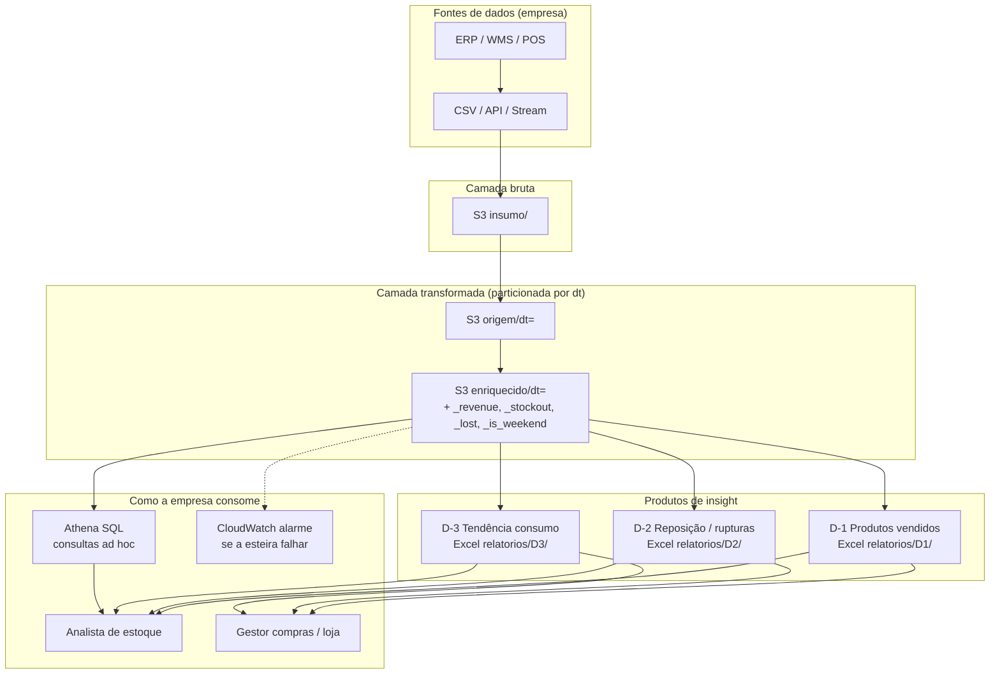
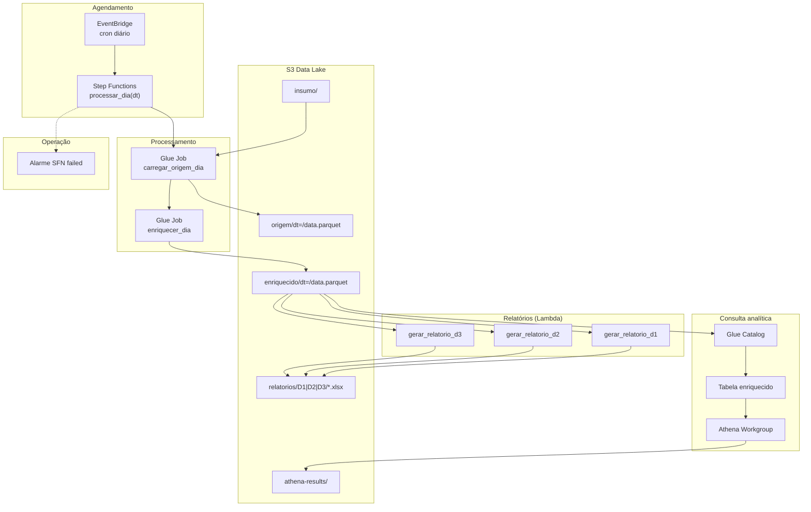
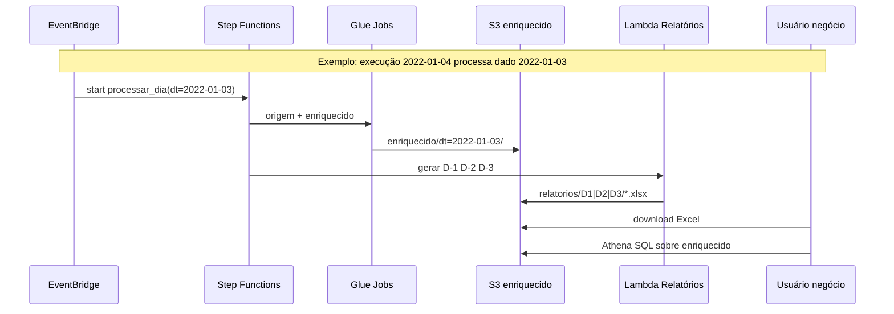
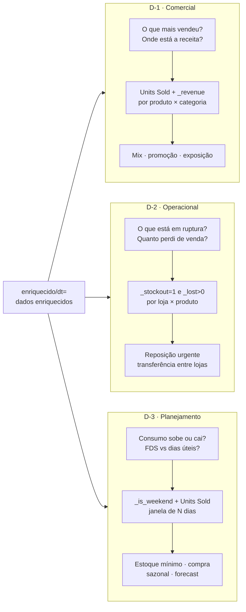
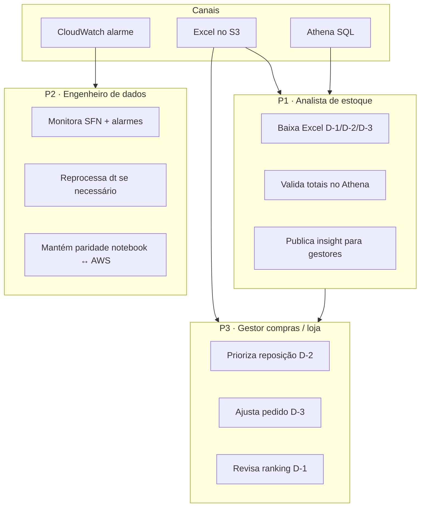
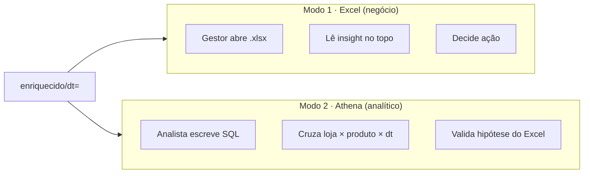
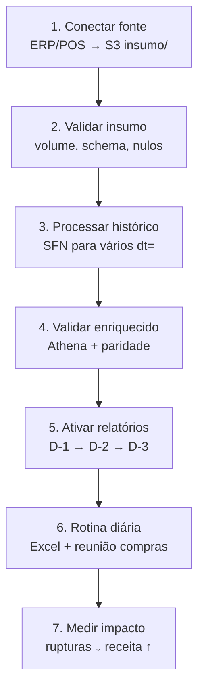

# Como usar o datamesh na empresa · Guia de insights

Este guia explica **como o datamesh de estoque varejo funciona** e **como equipes de negócio e tecnologia** o utilizam para gerar insights acionáveis (D-1, D-2, D-3).

| Item | Referência |
|------|------------|
| Diagramas Mermaid | [`diagrams/08-datamesh-empresa.mmd`](../diagrams/08-datamesh-empresa.mmd) |
| Queries Athena | [`scripts/athena-validation-queries.md`](../scripts/athena-validation-queries.md) |
| Documentação técnica | [`PROJETO_DATAMESH.txt`](../PROJETO_DATAMESH.txt) |
| Personas | [`aidlc-docs/inception/user-stories/personas.md`](../aidlc-docs/inception/user-stories/personas.md) |

---

## O que é este datamesh

Este projeto implementa uma **esteira de dados de produto** para varejo, com camadas padronizadas e três relatórios de insight:

| Camada S3 | Conteúdo |
|-----------|----------|
| `insumo/` | Dados brutos (CSV, futuro: ERP/POS) |
| `origem/dt=` | Snapshot diário filtrado |
| `enriquecido/dt=` | Métricas de negócio (`_revenue`, `_stockout`, `_lost`, `_is_weekend`) |
| `relatorios/D1\|D2\|D3/` | Excel para gestores |

**Defasagem D-1:** a esteira executa hoje (`DATA_EXECUCAO`) e processa o dado de **ontem** (`DIA_DADO` / `dt`).

---

## 1. Visão geral — da fonte ao insight



---

## 2. Arquitetura AWS



### Fluxo diário

1. **EventBridge** dispara no horário configurado.
2. **Step Functions** executa `processar_dia(dt)` com `dt = ontem`.
3. **Glue** grava `origem/dt=` e `enriquecido/dt=`.
4. **Lambdas** geram Excel D-1, D-2 e D-3.
5. **Analistas** baixam Excel ou consultam **Athena**.
6. Falha na SFN → **CloudWatch alarme**.

---

## 3. Ciclo temporal — execução vs dado



| Conceito | Significado | Exemplo |
|----------|-------------|---------|
| `DATA_EXECUCAO` | Quando a esteira rodou | 2022-01-04 |
| `DIA_DADO` / `dt` | Dia dos dados analisados | 2022-01-03 |
| Defasagem D-1 | Processa sempre o dia anterior | Vendas/estoque fechados de ontem |
| Janela D-3 | Últimos N dias até `dia_dado` | Tendência com 3, 7 ou 14 dias |

---

## 4. Três insights — pergunta, métrica, decisão



---

## 5. Personas e canais de consumo



| Persona | Relatório principal | Canal |
|---------|---------------------|-------|
| Analista de estoque | D-1, validação cruzada | Excel + Athena |
| Gestor compras / loja | D-2, D-3 | Excel |
| Engenheiro de dados | Operacional | SFN, CloudWatch, scripts |

---

## 6. Rotina diária na empresa

| Horário | Quem | Ação |
|---------|------|------|
| 06:00 | Plataforma | EventBridge dispara `processar_dia(ontem)` |
| 06:15 | Eng. dados | Confirma SFN **SUCCEEDED** (ou trata alarme) |
| 08:00 | Analista | Baixa Excel D-1, D-2, D-3 do S3 |
| 08:30 | Gestor compras | Lê D-2 — rupturas por `_lost` |
| 09:00 | Comercial | Lê D-1 — ranking e receita |

### D-1 · Produtos vendidos (decisão comercial)

**Pergunta:** *O que saiu ontem? Onde está o dinheiro?*

| Campo | Uso |
|-------|-----|
| Ranking por unidades | Identificar best-sellers |
| Receita por produto | Focar margem vs volume |
| Insight no Excel | Concentração top 3 → risco de dependência |

**Exemplo:** P0014 e P0015 lideram há 5 dias → aumentar exposição e evitar ruptura nesses SKUs.

### D-2 · Reposição (decisão operacional)

**Pergunta:** *O que está em ruptura? Quanto estou perdendo?*

| Regra | Significado |
|-------|-------------|
| `_stockout = 1` | Ruptura de estoque |
| `_lost > 0` | Venda perdida estimada |
| Ordenação por `_lost` | Priorizar maior impacto financeiro |

**Exemplo:** Loja S003, produto P0007, `_lost = 42` → pedido expresso; transferir de outra loja se houver estoque.

### D-3 · Tendência (decisão de planejamento)

**Pergunta:** *O consumo sobe ou cai? Fim de semana vende mais?*

| Métrica | Uso |
|---------|-----|
| Média úteis vs FDS | Ajustar entrega antes do fim de semana |
| Tendência ±5% | Subindo → mais estoque; Caindo → reduzir pedido |
| Janela N dias | Mais dias = tendência mais estável |

**Exemplo:** Tendência **Subindo** + média FDS > úteis → reforçar estoque de quinta a sábado.

---

## 7. Dois modos de consumo



| Modo | Público | Quando usar |
|------|---------|-------------|
| Excel | Gestores, compradores | Rotina diária, decisão rápida |
| Athena | Analistas, BI | Validação, drill-down, cruzamentos |

---

## 8. Jornada de adoção



| Fase | Ondas | KPI |
|------|-------|-----|
| Fundação | W1–W2 | Partição `origem/dt=` todo dia |
| Inteligência | W3–W4 | SFN SUCCEEDED; alarme OK |
| Insights | W5–W6 | Gestores usam D-1/D-2/D-3 |
| Maturidade | Evolução | Dashboards, ERP real-time |

---

## 9. Reunião semanal sugerida

| Dia | Relatório | Participantes | Pauta |
|-----|-----------|---------------|-------|
| Segunda | D-1 | Comercial + estoque | Top vendas, mix por categoria |
| Terça | D-2 | Compras + lojas | Rupturas críticas, pedidos urgentes |
| Quarta | D-3 | Planejamento | Tendências, ajuste de mínimos |
| Diário | Alarme SFN | Eng. dados | Esteira rodou? Reprocessar se falhou |

---

## 10. Métricas de sucesso

| Métrica | Como medir | Fonte |
|---------|------------|-------|
| Rupturas ativas | `COUNT` onde `_stockout=1` | D-2 / Athena |
| Venda perdida | `SUM(_lost)` | D-2 |
| Concentração receita | Top 3 / total | D-1 |
| Tendência consumo | % Subindo vs Caindo | D-3 |
| SLA da esteira | SFN SUCCEEDED / dia | CloudWatch |

---

## 11. Como executar na AWS (referência)

```powershell
# Validar esteira + relatórios + Athena
.\scripts\w6-run-and-validate.ps1

# Baixar relatório D-2
aws s3 cp s3://retail-inventory-insights-dev-use1/relatorios/D2/ . --recursive --region us-east-1

# Reprocessar um dia
.\scripts\w4-run-and-validate.ps1 -Dts @("2022-01-03")
```

---

## Resumo

> A empresa **alimenta o insumo**, a esteira **processa ontem**, o enriquecido **calcula ruptura e receita**, e os três relatórios transformam isso em **decisões comerciais (D-1), operacionais (D-2) e de planejamento (D-3)** — com Excel para gestores e Athena para analistas.
