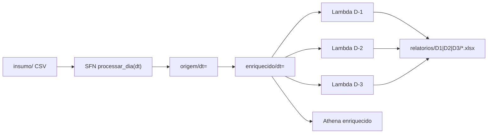

# Dev · Testar a esteira completa

Guia para **desenvolvedores** simularem o processo diário da esteira na AWS: backfill de partições, geração dos relatórios D-1/D-2/D-3, validação e inspeção do S3.

| Item | Valor |
|------|-------|
| Região | `us-east-1` |
| Bucket | `retail-inventory-insights-dev-use1` |
| Conta ref. | `303238378103` |
| Guia negócio | [`como-usar-datamesh-empresa.md`](como-usar-datamesh-empresa.md) |

---

## O que a esteira faz (visão dev)



| Etapa | Componente | Saída |
|-------|------------|-------|
| 1 | Glue `carregar_origem_dia` | `origem/dt=/data.parquet` |
| 2 | Glue `enriquecer_dia` | `enriquecido/dt=/data.parquet` |
| 3 | Lambda `gerar_relatorio_d1` | `relatorios/D1/*.xlsx` |
| 4 | Lambda `gerar_relatorio_d2` | `relatorios/D2/*.xlsx` |
| 5 | Lambda `gerar_relatorio_d3` | `relatorios/D3/*.xlsx` |

**Importante:** a Step Functions (W4) executa apenas **etapas 1–2**. Os relatórios (**3–5**) são Lambdas invocadas **separadamente** (scripts abaixo).

**Defasagem D-1:** `data_execucao = dia_dado + 1 dia`.

---

## Pré-requisitos

```powershell
cd c:\welligton-aws\project-datamesh-1

# AWS CLI autenticada
aws sts get-caller-identity --region us-east-1

# Python + pip (build do pacote Lambda)
python --version

# Terraform
terraform version
```

Insumo no S3:

```powershell
aws s3 ls s3://retail-inventory-insights-dev-use1/insumo/ --region us-east-1
```

Dataset demo: **731 dias** a partir de `2022-01-01`.

---

## Caminho rápido · simular N dias (recomendado)

Um script faz backfill + relatórios + download do último dia:

```powershell
# 7 dias de operação simulada (demo / CEO / D-3 com janela 7)
.\scripts\simular-esteira-dev.ps1 `
  -DiaInicio "2022-01-01" `
  -DiaFim "2022-01-07" `
  -JanelaD3 7
```

**Saída esperada:** `=== SIMULACAO DEV: OK ===` e pasta `demo-esteira-dev/` com 3 Excel do último dia.

### Parâmetros úteis

| Parâmetro | Efeito |
|-----------|--------|
| `-SkipBackfill` | Só gera relatórios (partições já existem) |
| `-SkipReports` | Só roda SFN (origem + enriquecido) |
| `-SkipTerraform` | Não faz apply (infra já deployada) |
| `-SkipDownload` | Não baixa Excel localmente |
| `-DownloadDir "minha-pasta"` | Onde salvar os `.xlsx` |

Exemplos:

```powershell
# So backfill (sem Excel)
.\scripts\simular-esteira-dev.ps1 -DiaInicio "2022-01-01" -DiaFim "2022-01-14" -SkipReports

# So relatórios (enriquecido já processado)
.\scripts\simular-esteira-dev.ps1 -DiaInicio "2022-01-01" -DiaFim "2022-01-07" -SkipBackfill

# 1 dia only
.\scripts\simular-esteira-dev.ps1 -DiaInicio "2022-01-03" -DiaFim "2022-01-03"
```

---

## Caminho por onda (validação incremental)

Use quando estiver debugando uma camada específica.

| Onda | Script | O que valida |
|------|--------|--------------|
| W2 | `.\scripts\w2-run-and-validate.ps1 -Dt "2022-01-01"` | Glue origem |
| W3 | `.\scripts\w3-run-and-validate.ps1 -Dt "2022-01-01"` | Glue enriquecido |
| W4 | `.\scripts\w4-run-and-validate.ps1 -Dts @("2022-01-01","2022-01-02")` | SFN processar_dia |
| W5 | `.\scripts\w5-run-and-validate.ps1` | Lambda D-1 + Excel |
| W6 | `.\scripts\w6-run-and-validate.ps1` | D-2, D-3, Athena, alarme |

**DoD completo W6 (1 dia):**

```powershell
.\scripts\w6-run-and-validate.ps1 `
  -DataExecucao "2022-01-08" `
  -DiaDado "2022-01-07" `
  -JanelaDias 7
```

Sucesso: `=== W6 DoD: CHECKS PASSED ===`

---

## Ver dias processados vs faltantes

```powershell
.\scripts\list-partitions.ps1 `
  -DiaInicio "2022-01-01" `
  -DiaFim "2022-01-31" `
  -Layer enriquecido
```

Trocar `-Layer origem` para ver só a camada origem.

Listagem manual S3:

```powershell
aws s3 ls s3://retail-inventory-insights-dev-use1/enriquecido/ --region us-east-1
aws s3 ls s3://retail-inventory-insights-dev-use1/relatorios/ --recursive --region us-east-1
```

Execuções recentes da SFN:

```powershell
aws stepfunctions list-executions `
  --state-machine-arn arn:aws:states:us-east-1:303238378103:stateMachine:retail-inventory-insights-processar-dia-dev `
  --max-results 10 `
  --region us-east-1
```

---

## Invocar relatórios manualmente (1 dia)

Substitua datas conforme o cenário (`dia_dado` = partição enriquecida):

```powershell
# D-1
aws lambda invoke `
  --function-name retail-inventory-insights-gerar-relatorio-d1-dev `
  --payload '{"data_execucao":"2022-01-04","dia_dado":"2022-01-03"}' `
  --cli-binary-format raw-in-base64-out `
  --region us-east-1 out-d1.json

# D-2
aws lambda invoke `
  --function-name retail-inventory-insights-gerar-relatorio-d2-dev `
  --payload '{"data_execucao":"2022-01-04","dia_dado":"2022-01-03"}' `
  --cli-binary-format raw-in-base64-out `
  --region us-east-1 out-d2.json

# D-3 (janela 7 dias)
aws lambda invoke `
  --function-name retail-inventory-insights-gerar-relatorio-d3-dev `
  --payload '{"data_execucao":"2022-01-04","dia_dado":"2022-01-03","janela_dias":7}' `
  --cli-binary-format raw-in-base64-out `
  --region us-east-1 out-d3.json

Get-Content out-d1.json
```

Processar **um** dia na SFN:

```powershell
aws stepfunctions start-execution `
  --state-machine-arn arn:aws:states:us-east-1:303238378103:stateMachine:retail-inventory-insights-processar-dia-dev `
  --input '{"dt":"2022-01-05"}' `
  --region us-east-1
```

---

## Validar com Athena

Queries prontas: [`scripts/athena-validation-queries.md`](../scripts/athena-validation-queries.md)

Smoke test:

```powershell
aws athena start-query-execution `
  --query-string "SELECT dt, COUNT(*) AS n FROM retail_inventory_insights_dev.enriquecido WHERE dt BETWEEN '2022-01-01' AND '2022-01-07' GROUP BY dt ORDER BY dt" `
  --query-execution-context Database=retail_inventory_insights_dev `
  --work-group retail-inventory-insights-dev `
  --region us-east-1
```

| `n` por `dt` | Significado |
|--------------|-------------|
| **100** | Dia processado OK (5 lojas × 20 produtos) |
| **0** ou erro | Partição ausente — rodar SFN para esse `dt` |

---

## Checklist dev · esteira pronta para demo

```
[ ] aws sts get-caller-identity OK
[ ] insumo/ no S3
[ ] simular-esteira-dev.ps1 → SIMULACAO DEV: OK
[ ] list-partitions → 0 faltantes no intervalo
[ ] w6-run-and-validate.ps1 → CHECKS PASSED
[ ] demo-esteira-dev/ com D1, D2, D3 xlsx
[ ] ensure-sfn-alarm.ps1 → alarme existe
```

---

## Cenários de teste sugeridos

| Cenário | Comando | Objetivo |
|---------|---------|----------|
| Smoke 1 dia | `simular-esteira-dev.ps1 -DiaInicio 2022-01-01 -DiaFim 2022-01-01` | Validar pipeline mínimo |
| Semana operação | `-DiaInicio 2022-01-01 -DiaFim 2022-01-07 -JanelaD3 7` | Demo CEO / D-3 com histórico |
| Reprocessar 1 dt | `w4-run-and-validate.ps1 -Dts @("2022-01-03")` | Idempotência W4 |
| Só relatórios | `simular-esteira-dev.ps1 ... -SkipBackfill` | Testar Lambdas isoladas |
| Paridade local | `compare_enriquecido_parquet.py --dt 2022-01-01` | W3 vs notebook |

---

## Problemas comuns

| Sintoma | Causa | Solução |
|---------|-------|---------|
| Lambda `NoSuchKey` enriquecido | SFN não rodou para `dia_dado` | `w4` ou `simular-esteira-dev` backfill |
| D-3 `particoes_lidas` < janela | Faltam dias anteriores | Backfill intervalo maior |
| D-2 com 0 rupturas | Normal em alguns `dt` | Testar outro dia ou ver `_stockout` no Athena |
| Glue timeout | Conta/cold start | Reexecutar SFN para o mesmo `dt` |
| Build Lambda falha | pip/python ausente | `.\scripts\build_lambda_reports_package.ps1` |
| Terraform 403 alarme | IAM limitada | `.\scripts\ensure-sfn-alarm.ps1` |

---

## Operacao automatica (futuro)

Em **dev**, EventBridge cron está **desligado** (`enable_eventbridge_schedule = false`).

Para produção:

1. Habilitar schedule no Terraform.
2. Encadear Lambdas D-1/D-2/D-3 **após** a SFN (evolução da state machine).
3. Passar `dt` dinâmico (ontem) no input do EventBridge.

Até lá, use `simular-esteira-dev.ps1` ou cron externo chamando o script.

---

## Scripts relacionados

| Script | Descrição |
|--------|-----------|
| [`simular-esteira-dev.ps1`](../scripts/simular-esteira-dev.ps1) | Simulação multi-dia completa |
| [`list-partitions.ps1`](../scripts/list-partitions.ps1) | Processados vs faltantes |
| [`w4-run-and-validate.ps1`](../scripts/w4-run-and-validate.ps1) | SFN processar_dia |
| [`w5-run-and-validate.ps1`](../scripts/w5-run-and-validate.ps1) | Relatório D-1 |
| [`w6-run-and-validate.ps1`](../scripts/w6-run-and-validate.ps1) | D-2, D-3, Athena, alarme |
| [`build_lambda_reports_package.ps1`](../scripts/build_lambda_reports_package.ps1) | Build zip Lambdas |
| [`athena-validation-queries.md`](../scripts/athena-validation-queries.md) | Queries SQL |

---

## Referências

- Terraform: [`terraform/environments/dev/`](../terraform/environments/dev/)
- Lambdas: [`lambda/reports/`](../lambda/reports/)
- Estado projeto: [`aidlc-docs/aidlc-state.md`](../aidlc-docs/aidlc-state.md)
