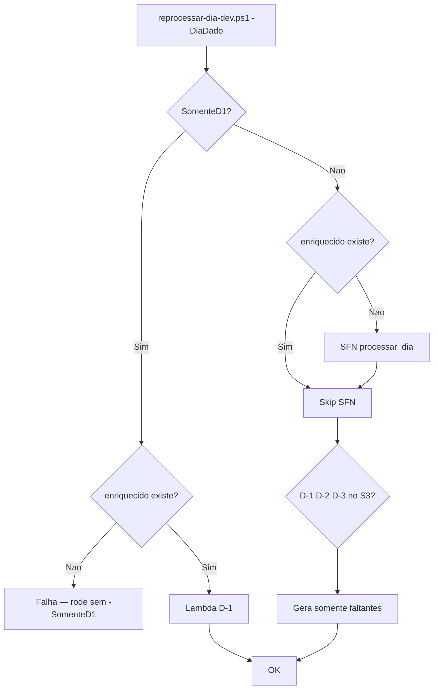

# Dev · Reprocessar dia (esteira falhou)

Procedimento do **engenheiro de dados** quando a execução diária falha ou falta relatório no S3.

| Item | Valor |
|------|-------|
| Script | [`reprocessar-dia-dev.ps1`](../scripts/reprocessar-dia-dev.ps1) |
| Região | `us-east-1` |
| Bucket | `retail-inventory-insights-dev-use1` |

---

## Quando usar

| Situação | Comando |
|----------|---------|
| Esteira falhou (sem `enriquecido/dt=`) | `reprocessar-dia-dev.ps1 -DiaDado "..."` |
| Esteira OK, **só falta D-1** | `reprocessar-dia-dev.ps1 -DiaDado "..." -SomenteD1` |
| Esteira OK, faltam D-1/D-2/D-3 | `reprocessar-dia-dev.ps1 -DiaDado "..."` (gera só o que falta) |

A SFN diária grava **origem + enriquecido**. Os Excel **não** são automáticos — o reprocessamento gera o que estiver faltando.

**Defasagem D-1:** `data_execucao = dia_dado + 1` → arquivo `relatorio_D1_exec2022-01-03_dado2022-01-02.xlsx`.

---

## Procedimento (1 comando)

```powershell
cd c:\welligton-aws\project-datamesh-1

# Caso mais comum: enriquecido existe, falta Excel D-1
.\scripts\reprocessar-dia-dev.ps1 -DiaDado "2022-01-02" -SomenteD1

# Esteira falhou ou faltam varios relatorios
.\scripts\reprocessar-dia-dev.ps1 -DiaDado "2022-01-03"
```

Sucesso: `=== REPROCESSAMENTO OK ===`

---

## O que o script faz



---

## Conferir antes / depois

```powershell
# Particoes processadas
aws s3 ls s3://retail-inventory-insights-dev-use1/enriquecido/ --region us-east-1

# Relatorios D-1
aws s3 ls s3://retail-inventory-insights-dev-use1/relatorios/D1/ --region us-east-1

# Intervalo: processados vs faltantes
.\scripts\list-partitions.ps1 -DiaInicio "2022-01-01" -DiaFim "2022-01-07"
```

---

## Pré-requisito

```powershell
aws sts get-caller-identity --region us-east-1
```

---

## Referências

- Queries Athena: [`athena-validation-queries.md`](../scripts/athena-validation-queries.md)
- Guia negócio: [`como-usar-datamesh-empresa.md`](como-usar-datamesh-empresa.md)
- Scripts avançados (multi-dia, deploy): `simular-esteira-dev.ps1`, `w4`–`w6-run-and-validate.ps1`
